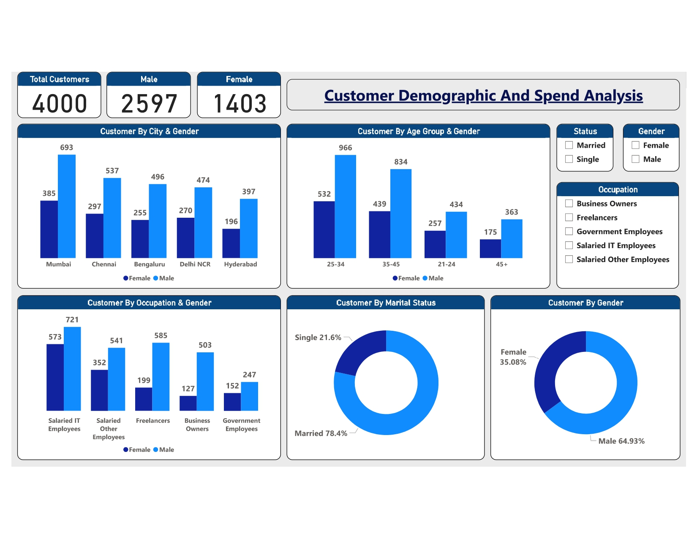
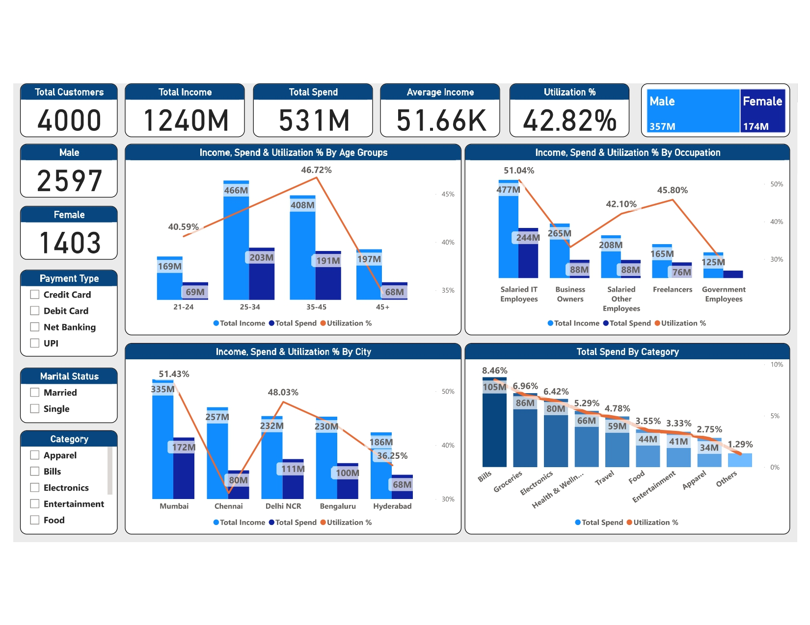
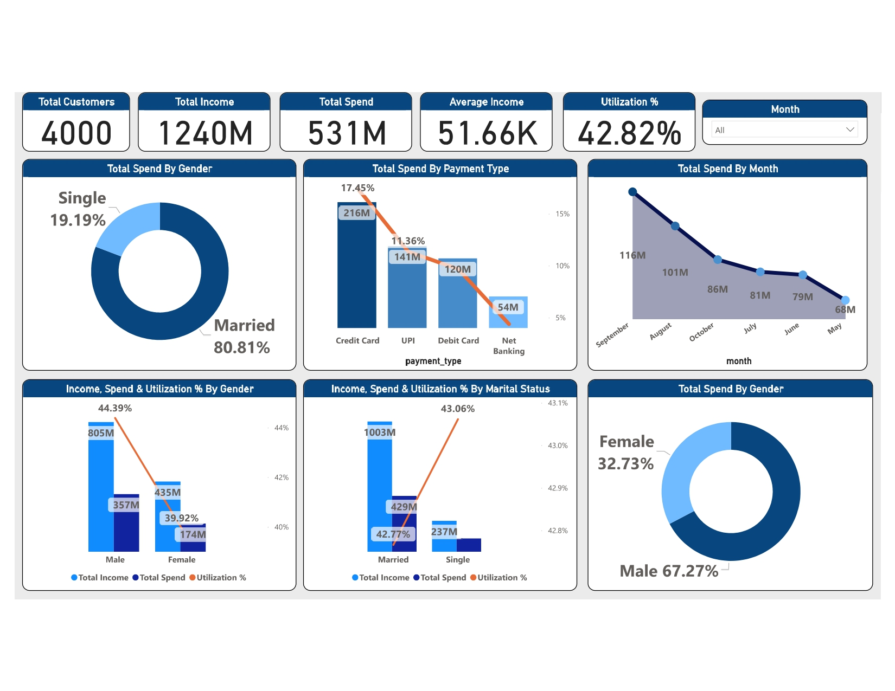

# Demographic and Spending Analysis Dashboard

## Introduction

This project aims to develop a comprehensive dashboard using Power BI to analyze demographic data and spending patterns. The dashboard provides insights into customer demographics, income utilization, and spending behavior, enabling stakeholders to make informed decisions for targeted marketing strategies and product development.

## Objectives

1. **Demographic Analysis:** Analyze customer demographics such as age group, gender, occupation, and city-wise distributions.
2. **Income Utilization Analysis:** Calculate average income utilization percentage and identify spending patterns by income group.
3. **Spending Insights:** Determine where customers spend the most and analyze spending behavior based on demographics and other factors.
4. **Dashboard Development:** Create interactive and visually appealing dashboards in Power BI to present key insights and facilitate data-driven decision-making.

## Data Collection and Preparation

The raw data for this analysis was obtained from [source]. It includes demographic information such as age, gender, occupation, income, and spending details. The data was cleaned and processed using Python and SQL to ensure accuracy and consistency.

## Analysis

### Demographic Analysis

Unveil the intricacies of customer demographics through a thorough examination of age groups, gender distributions, occupational profiles, and geographical concentrations. This segmentation provides invaluable insights into the composition of the target audience and informs targeted marketing efforts.

### Income Utilization Analysis

Ascertain the utilization of income by calculating the average income utilization percentage across different segments. By dissecting spending patterns relative to income levels, discern trends and behaviors indicative of varying levels of financial prudence and discretionary spending.

### Spending Insights

Illuminate the landscape of consumer spending by identifying prevalent expenditure categories and analyzing spending behavior across different demographic cohorts. Uncover patterns and correlations between spending habits and demographic attributes, offering strategic insights for product development and marketing initiatives.

## Dashboard Development

The culmination of this project manifests in the development of three interactive dashboards using Power BI:

1. **Demographic Analysis Dashboard**
   
3. **Income Utilization Dashboard**
   
5. **Spending Insights Dashboard**
   

These dashboards visually present key insights derived from the analysis, facilitating a deeper understanding of customer demographics and spending behavior.

## Conclusion

The developed dashboards provide valuable insights into customer demographics and spending behavior. By leveraging these insights, stakeholders can tailor marketing strategies, enhance product features, and optimize business operations for improved customer satisfaction and profitability.
